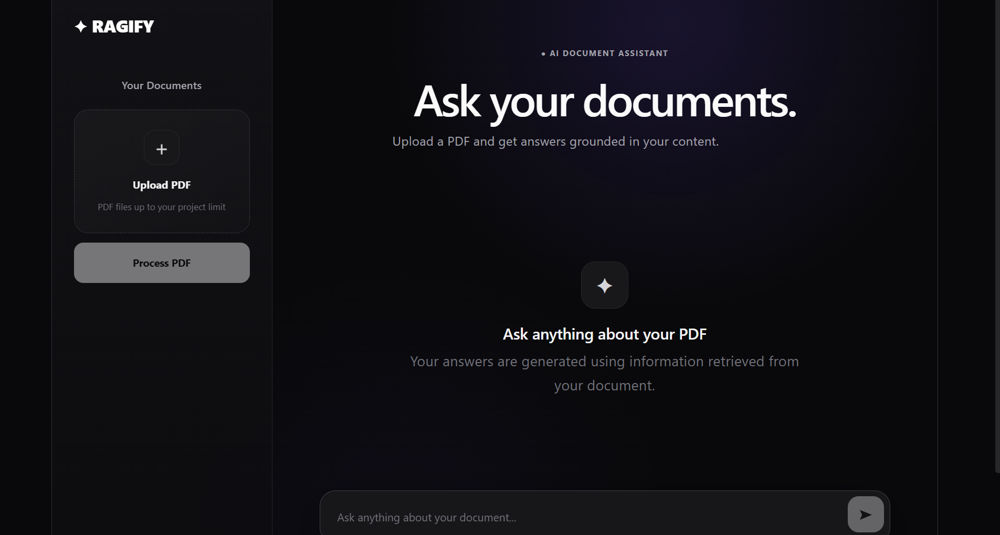
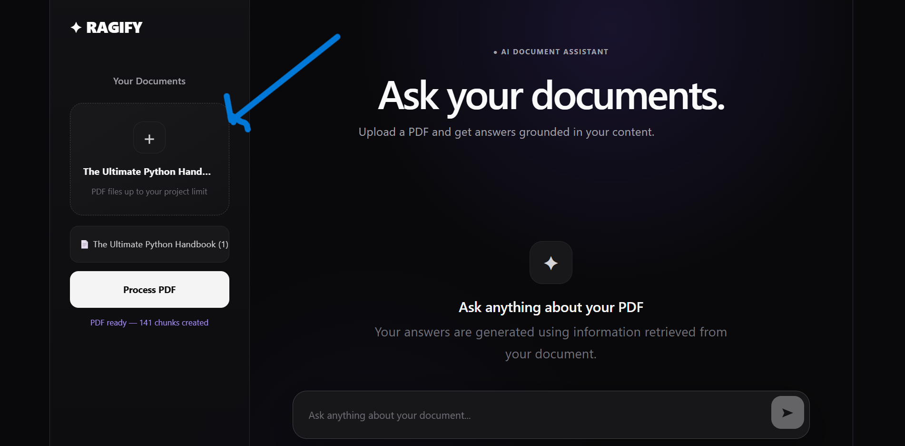
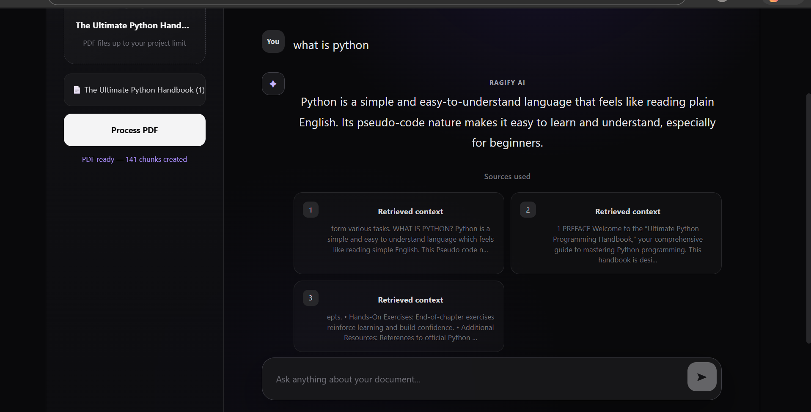
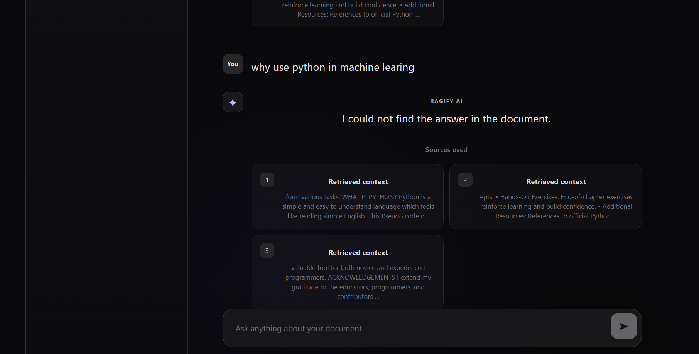

# 📚 RAG Notes Q&A Bot

A simple **PDF-based RAG (Retrieval-Augmented Generation) application** that allows users to upload a PDF, ask questions about its content, and get answers generated using relevant information retrieved from the document.

The project is built to understand the **core RAG pipeline without using LangChain**.

---

## 🚀 Features

* Upload a PDF document
* Extract text from the PDF
* Split extracted text into smaller chunks
* Convert chunks into embeddings
* Store embeddings using FAISS
* Retrieve relevant chunks for a user's question
* Generate answers using an LLM
* Display retrieved source chunks
* Show the number of chunks created from the document
* React frontend connected with FastAPI backend

---

## 🛠️ Tech Stack

### Frontend

* React.js
* Vite
* JavaScript
* HTML/CSS

### Backend

* Python
* FastAPI
* Uvicorn

### RAG / AI

* Sentence Transformers
* FAISS
* GROQ API

### PDF Processing

* PyPDF

---

# 🏗️ System Architecture

The application follows a simple client-server RAG architecture.

```text
                    ┌──────────────────┐
                    │    React.js      │
                    │    Frontend      │
                    └────────┬─────────┘
                             │
                             │ HTTP
                             ▼
                    ┌──────────────────┐
                    │     FastAPI      │
                    │     Backend      │
                    └────────┬─────────┘
                             │
              ┌──────────────┴──────────────┐
              │                             │
              ▼                             ▼
      ┌───────────────┐             ┌───────────────┐
      │ PDF Processing│             │ User Question │
      └───────┬───────┘             └───────┬───────┘
              │                             │
              ▼                             ▼
        Text Extraction              Question Embedding
              │                             │
              ▼                             │
           Chunking                         │
              │                             │
              ▼                             │
         Embeddings                         │
              │                             │
              ▼                             ▼
        ┌─────────────────────────────────────┐
        │            FAISS Vector DB           │
        │         Similarity Search            │
        └──────────────────┬──────────────────┘
                           │
                           ▼
                    Relevant Chunks
                           │
                           ▼
                    ┌──────────────┐
                    │  Gemini LLM  │
                    └──────┬───────┘
                           │
                           ▼
                   Answer + Sources
                           │
                           ▼
                    React Frontend
```

---

## 🔧 Main Components

| Component             | Responsibility                                     |
| --------------------- | -------------------------------------------------- |
| React.js              | User interface and API communication               |
| FastAPI               | Backend API and RAG pipeline coordination          |
| PyPDF                 | Extracts text from PDF                             |
| Chunker               | Divides document text into smaller chunks          |
| Sentence Transformers | Converts text into embeddings                      |
| FAISS                 | Stores and searches vector embeddings              |
| Gemini                | Generates the final answer using retrieved context |

---

# 🧩 System Design

The system has two main flows:

## 1. Document Ingestion Flow

This happens when the user uploads a PDF.

```text
User Uploads PDF
       ↓
React.js
       ↓
FastAPI /upload
       ↓
PDF Text Extraction
       ↓
Text Chunking
       ↓
Create Embeddings
       ↓
Store Embeddings in FAISS
       ↓
Ready for Questions
```

The extracted text is divided into smaller chunks. Each chunk is converted into an embedding and added to the FAISS vector index.

---

## 2. Question Answering Flow

This happens when the user asks a question.

```text
User Question
      ↓
React.js
      ↓
FastAPI /ask
      ↓
Convert Question → Embedding
      ↓
FAISS Similarity Search
      ↓
Retrieve Top-K Relevant Chunks
      ↓
Send Question + Retrieved Context
      ↓
Gemini LLM
      ↓
Generated Answer
      ↓
Answer + Sources
      ↓
React.js
```

---

# ⚙️ Working Model

## Step 1 — Upload PDF

The user uploads a PDF through the React frontend.

The frontend sends the PDF to the FastAPI `/upload` endpoint.

## Step 2 — Extract Text

FastAPI uses PyPDF to extract text from the PDF.

```text
PDF → Raw Text
```

## Step 3 — Create Chunks

The extracted text is divided into smaller pieces.

```text
Original Document
        ↓
     Chunk 1
     Chunk 2
     Chunk 3
     Chunk 4
       ...
```

This makes it easier to find the relevant part of a large document.

## Step 4 — Create Embeddings

Each text chunk is converted into a numerical vector using the Sentence Transformers model.

```text
"Process is a program in execution"
              ↓
        Embedding Vector
```

These vectors represent the semantic meaning of the text.

## Step 5 — Store in FAISS

The embeddings are stored in a FAISS index.

FAISS allows the application to search for vectors that are similar to the user's question.

## Step 6 — User Asks a Question

For example:

```text
What is a process?
```

The question is also converted into an embedding.

```text
Question
   ↓
Question Embedding
```

## Step 7 — Similarity Search

The question embedding is compared with the document embeddings.

FAISS retrieves the most relevant chunks.

```text
Question
   ↓
FAISS
   ↓
Top-K Relevant Chunks
```

In this project, the application retrieves the top relevant chunks using `top_k`.

## Step 8 — Context + Question → LLM

The retrieved chunks are combined with the user's question and sent to the Gemini model.

```text
Relevant Context
       +
User Question
       ↓
    Gemini
       ↓
Generated Answer
```

The prompt instructs the model to answer using the provided document context.

## Step 9 — Display Result

The FastAPI backend returns the generated answer and retrieved source chunks to React.

The frontend displays:

```text
Answer
   +
Retrieved Source
   +
Chunk Information
```

This allows the user to see the information retrieved from the document.

---

# 🔄 Complete Working Flow

```text
                    DOCUMENT INGESTION
                    ==================

                         PDF Upload
                              ↓
                        Text Extraction
                              ↓
                           Chunking
                              ↓
                         Embeddings
                              ↓
                       FAISS Vector DB
                              │
                              │
                              ▼
                     Document is Ready


                    QUESTION ANSWERING
                    ==================

                       User Question
                              ↓
                       Question Embedding
                              ↓
                     FAISS Similarity Search
                              ↓
                     Relevant Top-K Chunks
                              ↓
                    Context + Question
                              ↓
                         Gemini LLM
                              ↓
                    Answer + Source Chunks
                              ↓
                       React Frontend
```

---

# 🧠 How RAG Works

RAG stands for **Retrieval-Augmented Generation**.

Instead of asking an LLM to answer only from its existing knowledge, relevant information is first retrieved from the uploaded document and then provided to the LLM as context.

The basic pipeline is:

```text
Document
   ↓
Chunk
   ↓
Embed
   ↓
Store
   ↓
Retrieve
   ↓
Generate
```

---

## 🔑 Key Concepts

### Chunking

Large documents are divided into smaller pieces so that relevant information can be retrieved more effectively.

### Embeddings

Embeddings convert text into numerical vectors that represent the semantic meaning of the text.

### FAISS

FAISS is used to store and search vector embeddings for similarity.

### Similarity Search

The user's question is converted into an embedding and compared with document embeddings to find relevant chunks.

### Top-K

`top_k` defines how many relevant chunks are retrieved for a question.

---

# 📸 Screenshots

## 1. Application Interface



## 2. PDF Processing



## 3. Question Answering



## 4.If question does not exist




---

# 📂 Project Structure

```text
rag-notes-bot/
│
├── backend/
│   ├── main.py
│   ├── pdf_reader.py
│   ├── chunker.py
│   ├── embeddings.py
│   ├── vector_db.py
│   ├── retriever.py
│   ├── generator.py
│   └── requirements.txt
│
├── frontend/
│   ├── src/
│   ├── public/
│   ├── package.json
│   └── ...
│
├── screenshots/
│   ├── home.png
│   ├── pdf-upload.png
│   └── answer.png
│
├── documents/
│
├── .gitignore
└── README.md
```

---

# ⚙️ Setup

## 1. Clone the Repository

```bash
git clone https://github.com/YOUR_USERNAME/rag-notes-bot.git
cd rag-notes-bot
```

## 2. Create Python Virtual Environment

```bash
python -m venv venv
```

Activate it on Windows:

```bash
venv\Scripts\activate
```

## 3. Install Backend Dependencies

```bash
pip install -r backend/requirements.txt
```

## 4. Add Groq API Key

Create a `.env` file inside the `backend` folder:

```env
GROQ_API_KEY=your_api_key_here
```

**Do not upload the `.env` file to GitHub.**

## 5. Start FastAPI Backend

```bash
cd backend
```

Run:

```bash
uvicorn main:app --reload
```

Backend:

```text
http://127.0.0.1:8000
```

FastAPI documentation:

```text
http://127.0.0.1:8000/docs
```

## 6. Start React Frontend

Open another terminal:

```bash
cd frontend
npm install
npm run dev
```

Open the Vite development URL shown in the terminal.

---

# 🎯 Why I Built This Project

I built this project to understand the practical working of **Retrieval-Augmented Generation (RAG)** from the basics instead of directly relying on a framework.

The project helped me understand:

* Document processing
* Text chunking
* Embeddings
* Vector databases
* Similarity search
* Information retrieval
* LLM-based generation
* React and FastAPI communication

---

# 💡 Project Highlights

* Built the RAG pipeline manually without LangChain.
* Connected a React frontend with a FastAPI backend.
* Implemented PDF text extraction and chunking.
* Generated embeddings using Sentence Transformers.
* Implemented vector similarity search using FAISS.
* Used retrieved document context for LLM-based answers.
* Displayed retrieved source information along with the answer.

---

# 🔮 Future Improvements

The project is intentionally kept simple to focus on understanding the core RAG pipeline.

Possible future improvements include:

* LangChain implementation
* Better chunking with overlap
* Conversation history
* Multiple document support
* Improved source/page references
* RAG evaluation

---

# 📚 Learning Outcome

This project provided hands-on experience in building a complete **RAG application from scratch**.

The complete flow is:

```text
User
 ↓
React.js
 ↓
FastAPI
 ↓
PDF Processing
 ↓
Chunking
 ↓
Embeddings
 ↓
FAISS
 ↓
Similarity Search
 ↓
Relevant Context
 ↓
Gemini LLM
 ↓
Answer + Sources
 ↓
React.js
```

The main concept learned from the project is:

> **Retrieve relevant information first, then use the LLM to generate the answer using that information.**

---

## 👨‍💻 Author

Anish Rawat

Built as a hands-on project to learn and understand RAG, vector search, FastAPI, and React.js.


